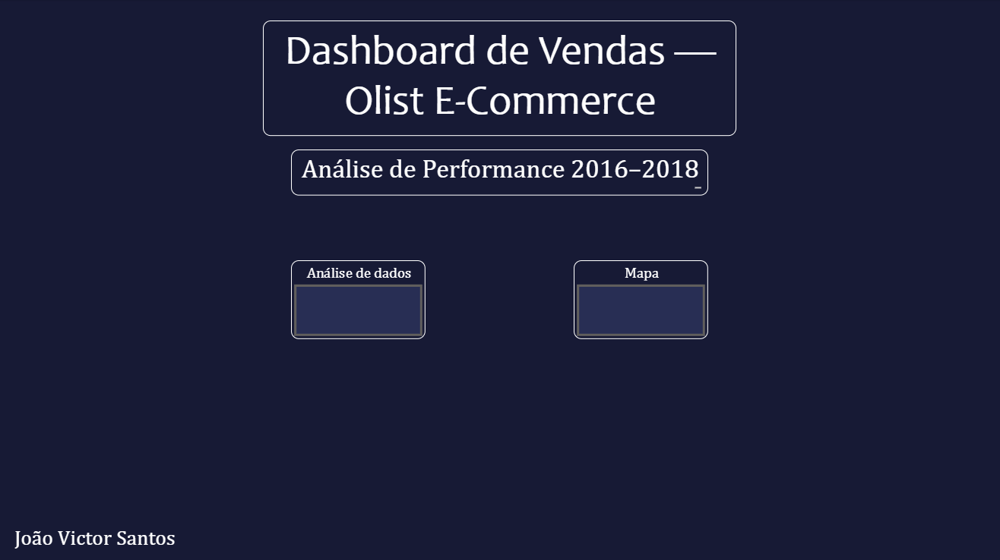

 Contexto do Projeto:
 Este projeto apresenta uma análise de dados reais do ecossistema de e-commerce brasileiro (Olist). O objetivo foi transformar um grande volume de dados brutos em insights estratégicos para apoiar a tomada de decisão em vendas, logística e mix de produtos.A análise foca em identificar gargalos operacionais e oportunidades de crescimento em um cenário de mais de 100 mil pedidos. 
 Tecnologias e Metodologia:
 Ferramenta de BI: Power BI.Modelagem de Dados: Estruturação em Star Schema (Fatos e Dimensões) para garantir performance e escalabilidade.
 Cálculos Avançados: Criação de medidas utilizando DAX para indicadores dinâmicos.
 ETL Interno: Limpeza e transformação de dados via Power Query. 
 KPIs e Visões Desenvolvidas
 O dashboard foi estruturado em três pilares principais para facilitar a análise dos gestores:Visão Executiva:Faturamento Total vs. Meta Mensal.Ticket Médio por Pedido.Evolução temporal de vendas.Análise de Produtos:Top 10 Categorias mais rentáveis.Curva ABC de produtos (identificação dos itens que geram 80% da receita).
 Logística e Regiões: Mapa de calor de vendas por estado.Análise de tempo médio de entrega (Lead Time).
 Visualização do Dashboard (Abaixo estão os registros visuais da ferramenta desenvolvida) 
 Insights Extraídos: Identificação de categorias com alto volume de vendas, mas ticket médio abaixo da meta de margem.
 Mapeamento de estados com maior índice de atraso logístico, sugerindo a necessidade de novos parceiros de frete nessas regiões.
 Como isso conecta com meu perfil?
 Este projeto demonstra minha capacidade de aplicar na prática os conceitos de Business Intelligence e Análise de Dados que utilizo diariamente na Volkswagen do Brasil , unindo o conhecimento técnico de ferramentas à visão estratégica de negócios adquirida na FAE Business School.

